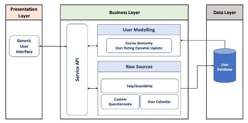

# AdaptiveUserScheduleEnhancer #

The Adaptive Calendar Application is a project that offers users a personalized experience by creating customized recommendations for events and activities based on their preferred restaurants, interests, and schedule. The project retrieves users' interests from Yelp API, custom Questionnaire, and their schedule from an .ics file to generate a user model that creates personalized recommendations for events, including restaurant reservations and concerts, to offer a more engaging experience.

# System Architecture #

# APIs #

To achieve this, APIs have been developed to input and process the data given by users to provide suitable recommendations for the adaptive application. The APIs are responsible for executing all the backend logics of the application and establishing the interaction between the front-end, back-end, and the database of the system. The APIs include:

## User Registration API ##

End Point - /user_registration

This API is called once the user completes the process of registration. User details
such as username, preferred restaurant types, preferred cuisines, preferred ratings,
preferred price range, subreddits followed by user and their interests are given as a
JSON input in the form of a post request to this API. This data is then pushed into
a table userlist in the MYSQL database which consists of all the user details. The
API also calls a function userModelInit() which creates two tables event_user_model
and restaurant_user_model for this individual user in order to create an initial user
model based on the given information from the user during the registration process.
A unique user ID for the newly registered user is returned as the response from the
API.

## Generate Event Recommendation API ##

End Point -/generate_event_recommendation
This API is called whenever the user needs to access their recommendations. The
unique user ID and the current time are given as a JSON input in the form of a post
request to the API. Internally, this API extracts the free time of the user from their
calendar (.ics file) by calling the method get_free_time_slots(). Using this data
of free time slots of the user, another method get_event_recomandation() is called
which uses the tableevent_user_model for this particular user from the database in
order to compute and get all the suitable events recommendations for the user based
on their free time slots and preferences. Event ID, Name, Category, Link, Location
and Ticket Fare is returned as the response from the API.

## Generate Restaurant Recommendation API ##

End Point -/generate_res_recommendation
This API is also called whenever the user needs to access their recommendations.
The unique user ID is given as a JSON input in the form of a post request to the API.
Internally, this API checks for a condition whether the current time is suitable for
lunch or dinner (is the time between 12PM to 3PM and 6PM to 9PM). The response is
generated only if the condition is satisfied. getRestaurantRecommendation() method
is called which uses the table restaurant_user_model for this particular user in order
to compute and get all the suitable restaurant recommendations for the user based on
their preferences. Restaurant Name, Link, Number of reviews, Price, Location and
Phone number is returned as the response from the API.

## Update Recommendation API ##

End Point -/update_recommendation
This API is called whenever the user rejects a recommendation generated by the
application. The unique user ID, rating value for the discounting the score, recommendation name (Restaurant or Event Name), a Boolean value ’isevent’ (to specify
whether it is an event or restaurant recommendation) is given as a JSON input in the
form of a post request to the API. Internally, this API checks for the ’isevent’ value
and calls the method updateUserModel() if its a restaurant recommendation or calls
the method updateEventUserModel() if its an event recommendation. These methods then access tables restaurant_user_model and event_user_model respectively
and subtract the rating score for that particular restaurant or an event. This process re-calculates the reduced cosine similarity score based on the subtracted rating
of that particular restaurant or event so that it can be diminished (less prioritised)
while providing the recommendation for that particular user in future. This ensures
that the application keeps on adapting and recommendations will be updated as per

# Front End Design #

The front-end design of the adaptive application is a critical component that enables the adaptation of content and functionalities to the user. It collects user data and interactions to inform the adaptation process, ensuring a positive user experience, granting users control over system behavior and functionality, and providing feedback on the system's adaptation to changing scenarios. The user interface design was also regarded from a product design perspective to ensure an intuitive and user-friendly interface, which significantly shapes the user's perceptions and interactions with the product.
